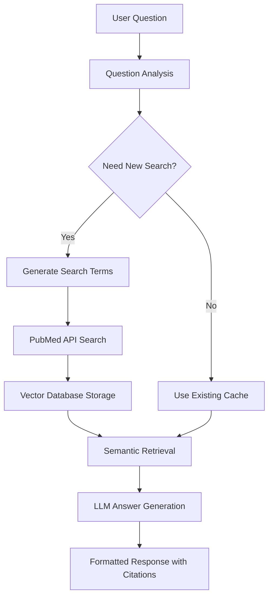

# 🧬 PubMedRAG

<div align="center">

[](https://www.python.org/downloads/)
[](https://opensource.org/licenses/MIT)
[](https://badge.fury.io/py/pubmedrag)
[](https://pepy.tech/project/pubmedrag)
[](https://github.com/Zaoqu-Liu/PubMedRAG)

**🔬 Question-Driven Medical Literature Research Assistant**

*Ask questions, get evidence-based answers from PubMed literature with automatic citations*

[📖 Documentation](#-documentation) • [🚀 Quick Start](#-quick-start) • [💡 Examples](#-examples) • [🛠️ API Reference](#️-api-reference) • [🤝 Contributing](#-contributing)

---

### ✨ Transform your research workflow

```bash
❓ Ask a question: What is the role of THBS2 in cancer immunotherapy?
🔍 Analyzing question...
🔍 Searching: THBS2[Title/Abstract] AND cancer immunotherapy[Title/Abstract]
📄 Found 47 articles
✅ Successfully indexed 47 articles

💡 Answer: THBS2 (Thrombospondin-2) plays several important roles in cancer immunotherapy...
```

</div>

---

## 🌟 Why PubMedRAG?

| Traditional Research | PubMedRAG |
|---------------------|-----------|
| ❌ Manual literature search | ✅ **Automated intelligent search** |
| ❌ Time-consuming paper reading | ✅ **AI-powered synthesis** |
| ❌ No citation management | ✅ **Automatic citations with metadata** |
| ❌ Fragmented knowledge | ✅ **Cumulative knowledge building** |
| ❌ Repetitive searches | ✅ **Smart cache & topic reuse** |

---

## 🎯 Key Features

### 🧠 **Intelligent Question Processing**
- **Natural Language Queries**: Ask questions in plain English
- **Smart Search Term Generation**: AI generates 10-30 optimized PubMed search terms
- **Context-Aware Follow-ups**: Intelligently determines if new searches are needed

### 📚 **Advanced Literature Management**
- **Automated PubMed Integration**: Direct API access to PubMed database
- **Vector-Based Retrieval**: Semantic search using sentence transformers
- **Citation Management**: Automatic formatting with titles, journals, dates, and PMID links

### 🧮 **Smart Caching System**
- **Topic Recognition**: AI identifies research topics and suggests cache reuse
- **Session Management**: Save and resume research sessions
- **Knowledge Accumulation**: Build comprehensive topic-specific databases

### 🔧 **Flexible Configuration**
- **Multiple LLM Support**: DeepSeek, OpenAI, or custom APIs
- **Configurable Search Ranges**: Customize search term quantities
- **Rate Limiting**: Built-in NCBI API compliance

---

## 🚀 Quick Start

### Installation

```bash
# Install from PyPI
pip install pubmedrag

# Or install from source
git clone https://github.com/Zaoqu-Liu/PubMedRAG.git
cd PubMedRAG
pip install -e .
```

### Basic Usage

#### 1. Command Line Interface

```bash
# Start interactive session
pubmedrag

# Or use short alias
pmrag
```

#### 2. Python API

```python
from pubmedrag import QuestionDrivenRAG

# Initialize the system
rag = QuestionDrivenRAG(
    email="your-email@example.com",
    llm_api_key="your-api-key",
    llm_base_url="https://api.deepseek.com/v1",
    llm_model="deepseek-chat"
)

# Ask a question
result = rag.answer_question("What is the role of THBS2 in cancer immunotherapy?")

# Get the answer
print(result['answer'])

# Access citations
for citation in result['citations']:
    print(f"[{citation['number']}] {citation['title']}")
```

---

## 📖 Documentation

### System Architecture



### Workflow Overview

1. **Question Input**: User asks a research question
2. **Topic Matching**: System checks for existing relevant research topics
3. **Search Strategy**: AI determines optimal search terms (10-30 for initial, 5-30 for follow-up)
4. **Literature Retrieval**: Automated PubMed searches with rate limiting
5. **Vector Processing**: Articles are chunked and embedded for semantic search
6. **Answer Generation**: LLM synthesizes information with proper citations
7. **Session Management**: Results are cached for future use

---

## 🛠️ Configuration

### Environment Variables

```bash
# Optional: Set default configurations
export PUBMEDRAG_EMAIL="your-email@example.com"
export PUBMEDRAG_API_KEY="your-api-key"
export NCBI_API_KEY="your-ncbi-key"  # For higher rate limits
```

### LLM Provider Configuration

#### DeepSeek (Recommended)
```python
rag = QuestionDrivenRAG(
    email="your@email.com",
    llm_api_key="your-deepseek-key",
    llm_base_url="https://api.deepseek.com/v1",
    llm_model="deepseek-chat"
)
```

#### OpenAI
```python
rag = QuestionDrivenRAG(
    email="your@email.com",
    llm_api_key="your-openai-key",
    llm_base_url="https://api.openai.com/v1",
    llm_model="gpt-3.5-turbo"
)
```

#### Custom API
```python
rag = QuestionDrivenRAG(
    email="your@email.com",
    llm_api_key="your-custom-key",
    llm_base_url="https://your-api-endpoint.com/v1",
    llm_model="your-model-name"
)
```

### Advanced Configuration

```python
rag = QuestionDrivenRAG(
    # Basic settings
    email="your@email.com",
    llm_api_key="your-key",
    
    # Search configuration
    initial_search_terms_range=(15, 25),  # First question: 15-25 terms
    followup_search_terms_range=(8, 20),  # Follow-up: 8-20 terms
    
    # Model settings
    embedding_model="sentence-transformers/all-MiniLM-L6-v2",
    temperature=0.3,  # LLM creativity (0=focused, 1=creative)
    
    # Optional
    ncbi_api_key="your-ncbi-key"  # For higher rate limits
)
```

---

## 💡 Examples

### Example 1: Cancer Research

```python
from pubmedrag import QuestionDrivenRAG

rag = QuestionDrivenRAG(
    email="researcher@university.edu",
    llm_api_key="your-api-key",
    llm_base_url="https://api.deepseek.com/v1",
    llm_model="deepseek-chat"
)

# First question - establishes research topic
result1 = rag.answer_question("What are the molecular mechanisms of THBS2 in tumor microenvironment?")

# Follow-up question - uses existing knowledge base
result2 = rag.answer_question("How does THBS2 affect T cell function?")

# Display results
print("Answer:", result1['answer'])
print(f"Found {len(result1['citations'])} relevant papers")
```

### Example 2: Drug Research

```python
# Research a specific drug
result = rag.answer_question("What are the cardiovascular effects of GLP-1 receptor agonists?")

# Access structured citations
for citation in result['citations']:
    print(f"[{citation['number']}] {citation['title']}")
    print(f"Journal: {citation['journal']} ({citation['pub_date']})")
    print(f"PMID: https://pubmed.ncbi.nlm.nih.gov/{citation['pmid']}/")
    print()
```

### Example 3: Interactive Session

```python
# Start an interactive research session
questions = [
    "What is the role of autophagy in cancer?",
    "How do autophagy inhibitors work as cancer therapy?",
    "What are the clinical trials of autophagy inhibitors?"
]

for question in questions:
    result = rag.answer_question(question)
    print(f"Q: {question}")
    print(f"A: {result['answer'][:200]}...")
    print(f"Citations: {len(result['citations'])}")
    print("-" * 50)
```

---

## 🎮 CLI Commands

### Interactive Commands

| Command | Description | Example |
|---------|-------------|---------|
| `help` | Show available commands | `help` |
| `info` | Display session information | `info` |
| `history` | Show question history | `history` |
| `refs` | List all collected references | `refs` |
| `topics` | Show research topics | `topics` |
| `save` | Save current session | `save` |
| `load` | Load previous session | `load` |
| `stats` | Show cache statistics | `stats` |
| `clear` | Clear screen | `clear` |
| `exit` | Exit program | `exit` |

### Session Management

```bash
# Save a session with description
❓ Ask a question: save
Session description (optional): THBS2 cancer immunotherapy research

# Load previous sessions
❓ Ask a question: load
📁 Saved Sessions:
1. THBS2 cancer immunotherapy research
   Questions: 5, Articles: 127, Updated: 2 hours ago

# View session statistics
❓ Ask a question: stats
📈 Cache Statistics
─────────────────
Total sessions: 15
Total questions: 89
Total articles: 1,247
Cache size: 45.2 MB
```

---

## 🧪 Advanced Features

### Topic Intelligence

The system automatically manages research topics and can intelligently reuse existing databases:

```python
# When you ask a new question, the system checks existing topics
❓ Ask a question: How does THBS2 affect immune cell infiltration?

🎯 Found matching research topic:
Topic: THBS2 cancer immunotherapy research
Articles: 127
Session ID: abc12345...

Use existing database? (y/n): y
```

### Custom Search Strategies

```python
# Configure search term ranges for different research needs
rag = QuestionDrivenRAG(
    email="your@email.com",
    llm_api_key="your-key",
    
    # Broad initial search for comprehensive coverage
    initial_search_terms_range=(20, 30),
    
    # Focused follow-up searches
    followup_search_terms_range=(5, 15)
)
```

### Session Analytics

```python
# Get detailed session information
session_info = rag.get_session_info()
print(f"Session ID: {session_info['session_id']}")
print(f"Topic: {session_info['topic']}")
print(f"Total articles indexed: {session_info['total_articles']}")
print(f"Questions asked: {session_info['total_questions']}")
```

---

## 📊 Performance & Limits

### Performance Metrics

| Metric | Typical Value | Notes |
|--------|---------------|-------|
| Search Speed | 2-5 seconds per term | Depends on NCBI response |
| Indexing Speed | ~100 articles/minute | Local processing |
| Answer Generation | 2-10 seconds | Varies by LLM provider |
| Storage | ~1MB per 100 articles | Local vector database |

### Rate Limits

| Service | Free Limit | With API Key |
|---------|------------|--------------|
| NCBI E-utilities | 3 requests/second | 10 requests/second |
| DeepSeek API | Varies by plan | Check your quota |
| OpenAI API | Varies by plan | Check your quota |

### Recommendations

- **NCBI API Key**: Get one [here](https://www.ncbi.nlm.nih.gov/account/) for higher rate limits
- **Local Storage**: Ensure sufficient disk space for vector databases
- **Memory**: 4GB+ RAM recommended for large literature collections

---

## 🔧 Troubleshooting

### Common Issues

#### ❌ "No articles found"
```
Possible causes:
- Query too specific
- Spelling errors in gene/protein names
- Non-standard terminology

Solutions:
- Try broader terms
- Use official gene symbols
- Check PubMed directly first
```

#### ❌ "API connection failed"
```
Possible causes:
- Invalid API key
- Network connectivity issues
- Rate limit exceeded

Solutions:
- Verify API key in provider dashboard
- Check internet connection
- Wait and retry if rate limited
```

#### ❌ "ChromaDB collection error"
```
Possible causes:
- Insufficient disk space
- Permissions issues
- Corrupted database

Solutions:
- Free up disk space
- Check folder permissions
- Delete and recreate collection
```

### Debug Mode

```python
import logging
logging.basicConfig(level=logging.DEBUG)

# Now you'll see detailed logs
rag = QuestionDrivenRAG(email="...", llm_api_key="...")
```

### Cache Management

```python
from pubmedrag.cache import SessionCache

cache = SessionCache()

# View cache statistics
stats = cache.get_cache_statistics()
print(f"Total sessions: {stats['total_sessions']}")
print(f"Cache size: {stats['cache_size_mb']} MB")

# Clean up old sessions
sessions = cache.list_sessions()
for session in sessions[10:]:  # Keep only 10 most recent
    cache.delete_session(session['session_id'])
```

---

## 🏗️ Architecture

### Components

```
pubmedrag/
├── core.py              # Main RAG system
├── cache.py             # Session and topic management
├── utils.py             # Helper functions
├── cli.py               # Command-line interface
└── __init__.py          # Package initialization
```

### Dependencies

| Package | Purpose | Version |
|---------|---------|---------|
| `biopython` | PubMed API access | ≥1.79 |
| `langchain` | Text processing | ≥0.1.0 |
| `sentence-transformers` | Embeddings | ≥2.2.0 |
| `chromadb` | Vector database | ≥0.4.0 |
| `openai` | LLM interface | ≥1.0.0 |
| `colorama` | Terminal colors | ≥0.4.4 |

### Data Flow

1. **Question** → Question analysis & topic matching
2. **Search Terms** → LLM generates optimized PubMed queries
3. **Articles** → Retrieved from PubMed via Entrez API
4. **Chunks** → Text split into semantic chunks
5. **Embeddings** → Generated using sentence transformers
6. **Storage** → Stored in ChromaDB vector database
7. **Retrieval** → Semantic search for relevant chunks
8. **Answer** → LLM synthesis with citations

---

## 🧬 Research Applications

### Biomedical Research
- **Gene Function Analysis**: "What is the role of TP53 in DNA repair?"
- **Drug Mechanisms**: "How do PARP inhibitors work in BRCA-mutated cancers?"
- **Pathway Studies**: "What are the key components of the mTOR pathway?"

### Clinical Research
- **Treatment Efficacy**: "What is the efficacy of immunotherapy in lung cancer?"
- **Biomarker Discovery**: "What biomarkers predict response to checkpoint inhibitors?"
- **Side Effects**: "What are the cardiovascular risks of COX-2 inhibitors?"

### Meta-Analysis Preparation
- **Literature Surveys**: Comprehensive article collection for systematic reviews
- **Trend Analysis**: Understanding research evolution over time
- **Gap Identification**: Finding understudied areas

---

## 🎯 Best Practices

### Asking Effective Questions

✅ **Good Questions:**
```
- "What are the molecular mechanisms of X in disease Y?"
- "How does drug A compare to drug B for treating condition C?"
- "What biomarkers predict response to therapy D?"
- "What are the side effects of treatment E in population F?"
```

❌ **Less Effective:**
```
- "Tell me about cancer" (too broad)
- "X" (too vague)
- "Write a review about Y" (not a question)
```

### Session Management

```python
# Start with broad questions, then get specific
questions = [
    "What is the role of VEGF in angiogenesis?",  # Establish topic
    "How do VEGF inhibitors work?",               # Mechanism
    "What are the clinical trials of bevacizumab?", # Specific drug
    "What are the resistance mechanisms to VEGF inhibitors?" # Advanced
]
```

### Citation Management

```python
# Extract citations for external use
def export_citations(result):
    citations = []
    for citation in result['citations']:
        citations.append({
            'pmid': citation['pmid'],
            'title': citation['title'],
            'journal': citation['journal'],
            'year': citation['pub_date'],
            'url': f"https://pubmed.ncbi.nlm.nih.gov/{citation['pmid']}/"
        })
    return citations
```

---

## 🚀 Advanced Usage

### Batch Processing

```python
from pubmedrag import QuestionDrivenRAG
import json

# Initialize system
rag = QuestionDrivenRAG(
    email="researcher@university.edu",
    llm_api_key="your-api-key"
)

# Process multiple questions
questions = [
    "What is the role of p53 in cancer?",
    "How does p53 regulate apoptosis?",
    "What are p53 mutations in different cancers?"
]

results = []
for question in questions:
    result = rag.answer_question(question)
    results.append({
        'question': question,
        'answer': result['answer'],
        'citations_count': len(result['citations']),
        'search_performed': result['search_performed']
    })

# Save results
with open('research_results.json', 'w') as f:
    json.dump(results, f, indent=2)
```

### Custom Analysis

```python
from pubmedrag.utils import analyze_question_complexity

# Analyze question before processing
question = "What are the epigenetic mechanisms of gene silencing in cancer?"
analysis = analyze_question_complexity(question)

print(f"Keywords: {analysis['keywords']}")
print(f"Complexity score: {analysis['complexity_score']}/10")
```

### Integration with Other Tools

```python
# Export to pandas for analysis
import pandas as pd

def create_citation_dataframe(citations):
    data = []
    for citation in citations:
        data.append({
            'PMID': citation['pmid'],
            'Title': citation['title'],
            'Journal': citation['journal'],
            'Year': citation['pub_date'],
            'Authors': citation['authors']
        })
    return pd.DataFrame(data)

# Use the function
result = rag.answer_question("Your question here")
df = create_citation_dataframe(result['citations'])
print(df.head())
```

---

## 🤝 Contributing

We welcome contributions from the research community! 

### Development Setup

```bash
# Clone the repository
git clone https://github.com/Zaoqu-Liu/PubMedRAG.git
cd PubMedRAG

# Create virtual environment
python -m venv venv
source venv/bin/activate  # On Windows: venv\Scripts\activate

# Install development dependencies
pip install -e ".[dev]"

# Install pre-commit hooks
pre-commit install
```

### Areas for Contribution

- 🔍 **Search Algorithms**: Improve search term generation
- 📊 **Analytics**: Add answer quality metrics
- 🌐 **Integrations**: Support for PMC, bioRxiv, other databases
- 🎨 **Interface**: Web interface development
- 📱 **Mobile**: Mobile app development
- 🧠 **AI**: Better question understanding and routing

### Submission Guidelines

1. Fork the repository
2. Create a feature branch (`git checkout -b feature/amazing-feature`)
3. Make your changes
4. Add tests if applicable
5. Run the test suite (`pytest`)
6. Commit your changes (`git commit -m 'Add amazing feature'`)
7. Push to the branch (`git push origin feature/amazing-feature`)
8. Open a Pull Request

---

## 📜 License

This project is licensed under the MIT License - see the [LICENSE](LICENSE) file for details.

```
MIT License

Copyright (c) 2024 PubMedRAG Team

Permission is hereby granted, free of charge, to any person obtaining a copy
of this software and associated documentation files (the "Software"), to deal
in the Software without restriction, including without limitation the rights
to use, copy, modify, merge, publish, distribute, sublicense, and/or sell
copies of the Software, and to permit persons to whom the Software is
furnished to do so, subject to the following conditions:

The above copyright notice and this permission notice shall be included in all
copies or substantial portions of the Software.
```

---

## 🙏 Acknowledgments

- **NCBI/PubMed** for providing access to biomedical literature
- **Anthropic, OpenAI & DeepSeek** for language model capabilities
- **The Chroma Team** for the vector database
- **Sentence Transformers** for embedding models
- **The biomedical research community** for valuable feedback and testing

---

## 📞 Support & Community

### Get Help

- 📧 **Email**: contact@pubmedrag.com
- 🐛 **Issues**: [GitHub Issues](https://github.com/Zaoqu-Liu/PubMedRAG/issues)
- 💬 **Discussions**: [GitHub Discussions](https://github.com/Zaoqu-Liu/PubMedRAG/discussions)
- 📖 **Documentation**: [docs.pubmedrag.com](https://docs.pubmedrag.com)

### Citation

If you use PubMedRAG in your research, please cite:

```bibtex
@software{pubmedrag2024,
  title={PubMedRAG: Question-Driven Medical Literature Research Assistant},
  author={Liu, Zaoqu and PubMedRAG Team},
  year={2024},
  url={https://github.com/Zaoqu-Liu/PubMedRAG},
  version={2.0.0}
}
```

---

<div align="center">

**Made with ❤️ for the biomedical research community**

[](https://star-history.com/#Zaoqu-Liu/PubMedRAG&Date)

[⬆️ Back to Top](#-pubmedrag)

</div>