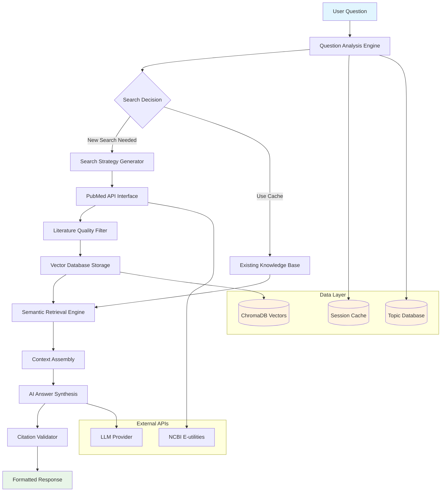
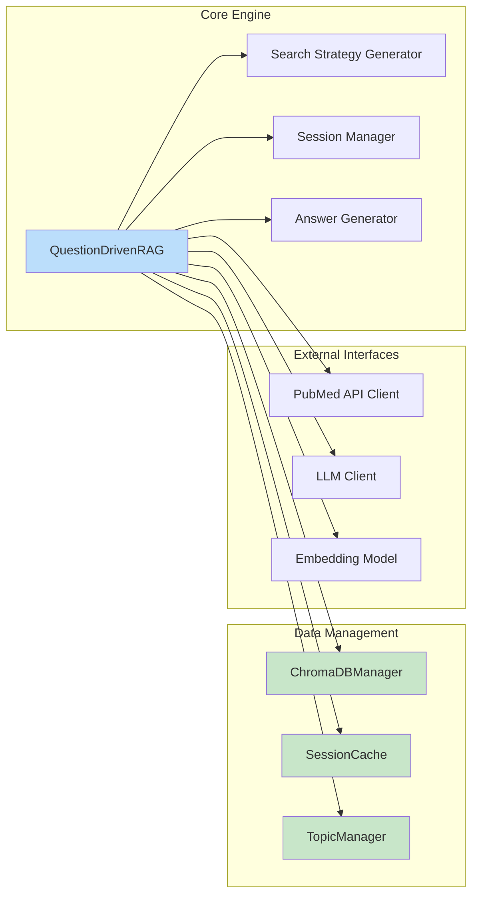

# 🧬 PubMedRAG

<div>

[](https://www.python.org/downloads/)
[](https://opensource.org/licenses/GPL3)
[](https://github.com/psf/black)
[](https://github.com/Zaoqu-Liu/PubMedRAG)

**Question-Driven Biomedical Literature Research Assistant**

*Automate PubMed literature research with AI-powered search strategy generation and semantic answer synthesis*

**Built for the biomedical research community**

[📖 Quick Start](#-quick-start) • [💡 Core Features](#-core-features) • [🔧 Architecture](#-architecture) • [🚀 Usage Examples](#-usage-examples) • [⚙️ Configuration](#️-configuration)

</div>

---

## 📖 Quick Start

### Installation

```bash
# Install from PyPI
pip install pubmedrag

# Or install from source
git clone https://github.com/Zaoqu-Liu/PubMedRAG.git
cd PubMedRAG
pip install -e .
```

### Basic Setup

1. **Create configuration file** (`.env`):
```bash
PUBMEDRAG_EMAIL=your-email@university.edu
PUBMEDRAG_API_KEY=your-api-key
PUBMEDRAG_BASE_URL=https://api.deepseek.com/v1
PUBMEDRAG_MODEL=deepseek-chat
```

2. **Start interactive session**:
```bash
pubmedrag
```

3. **Or use Python API**:
```python
from pubmedrag import QuestionDrivenRAG

rag = QuestionDrivenRAG(
    email="researcher@university.edu",
    llm_api_key="your-api-key",
    llm_base_url="https://api.deepseek.com/v1",
    llm_model="deepseek-chat"
)

result = rag.answer_question("What is the role of THBS2 in cancer immunotherapy?")
print(result['answer'])
```

---

## 💡 Core Features

### 🧠 Intelligent Search Strategy Generation
- Automatically generates 10-30 optimized PubMed search terms from natural language questions
- Identifies biomedical entities (genes, proteins, drugs, diseases, pathways)
- Adapts search complexity based on question scope and existing knowledge base

### 🔍 Dynamic Search Decision Engine
PubMedRAG intelligently determines when to perform new literature searches:

- **Initial questions**: Comprehensive search with 10-25 search terms
- **Follow-up questions**: AI analyzes existing knowledge coverage
  - New biomedical concepts detected → Execute targeted search (5-20 terms)
  - Concepts already covered → Reuse existing literature database

### 📚 Literature Processing Pipeline
- **Quality Control**: PMID validation, abstract length filtering, publication type exclusion
- **Semantic Chunking**: Intelligent text segmentation preserving context
- **Vector Storage**: 384-dimensional embeddings using sentence transformers
- **Metadata Preservation**: Full bibliographic information with automatic citation formatting

### 🤖 Evidence-Based Answer Generation
- **Context Assembly**: Retrieves relevant literature chunks using semantic similarity
- **AI Synthesis**: Combines retrieved evidence with domain knowledge
- **Citation Management**: Automatic reference numbering and PMID link generation
- **Quality Assurance**: Validates citations and removes duplicates

### 💾 Session Management
- **Topic Recognition**: AI-generated session labels for knowledge organization
- **Smart Caching**: Persistent storage with cross-session knowledge reuse
- **Performance Analytics**: Session statistics and literature coverage metrics

---

## 🔧 Architecture

### System Overview



### Component Architecture



### Key Components

| Component | Purpose | Implementation |
|-----------|---------|----------------|
| **QuestionDrivenRAG** | Core orchestration engine | Manages workflow from question to answer |
| **SessionCache** | Topic matching and persistence | CSV/JSON storage with intelligent retrieval |
| **ChromaDBManager** | Vector storage and retrieval | Persistent embeddings with metadata |
| **PubMed Interface** | Literature acquisition | NCBI E-utilities with rate limiting |

---

## 🚀 Usage Examples

### Single Question Research

```python
from pubmedrag import QuestionDrivenRAG

# Initialize
rag = QuestionDrivenRAG(
    email="researcher@university.edu",
    llm_api_key="your-api-key",
    llm_base_url="https://api.deepseek.com/v1",
    llm_model="deepseek-chat"
)

# Research question
result = rag.answer_question("How does THBS2 regulate angiogenesis in cancer?")

# Access results
print("Answer:", result['answer'])
print(f"Citations: {len(result['citations'])}")
print(f"New search performed: {result['search_performed']}")

# View citations
for citation in result['citations']:
    print(f"[{citation['number']}] {citation['title']}")
    print(f"   {citation['journal']} {citation['pub_date']}")
    print(f"   https://pubmed.ncbi.nlm.nih.gov/{citation['pmid']}/")
```

### Multi-Question Research Session

```python
# Systematic topic exploration
questions = [
    "What is the basic function of THBS2?",
    "How does THBS2 interact with immune cells?",
    "What is THBS2's role in tumor angiogenesis?",
    "Can THBS2 be targeted for cancer therapy?"
]

research_summary = []
for i, question in enumerate(questions, 1):
    print(f"\n=== Question {i} ===")
    result = rag.answer_question(question)
    
    research_summary.append({
        'question': question,
        'answer_preview': result['answer'][:200] + "...",
        'citations_count': len(result['citations']),
        'new_search': result['search_performed']
    })
    
    print(f"Citations: {len(result['citations'])}")
    print(f"New search: {result['search_performed']}")

# Session statistics
session_info = rag.get_session_info()
print(f"\nTotal articles indexed: {session_info['total_articles']}")
print(f"Search terms used: {session_info['total_search_terms']}")
```

### Command Line Interface

#### Starting the CLI

```bash
# Start interactive session
pubmedrag

# Or use short alias
pmrag
```

#### Interactive Commands

The CLI supports several built-in commands for session management:

| Command | Description | Usage |
|---------|-------------|-------|
| `help` or `?` | Show available commands | `help` |
| `info` | Display current session information | `info` |
| `history` | Show question history | `history` |
| `refs` | List all collected references | `refs` |
| `topics` | Show research topics | `topics` |
| `stats` | Show cache statistics | `stats` |
| `clear` | Clear screen | `clear` |
| `exit`, `quit`, `bye` | Exit the program | `exit` |

#### Example CLI Session

```bash
$ pubmedrag

🧬 PubMedRAG - Question-Driven Biomedical Literature Assistant
✅ Configuration loaded successfully
✅ System ready!

❓ Ask a question: What is the role of THBS2 in immunity?
🔍 Analyzing question...
🔍 Generated 12 search terms
📄 Found 47 articles
✅ Indexed 47 articles

💡 Answer: THBS2 (Thrombospondin-2) plays several roles in immune regulation...

📚 References
[1] Smith J et al. THBS2 modulates T cell activation. Nature. 2023. https://pubmed.ncbi.nlm.nih.gov/12345678/
[2] Johnson A et al. Thrombospondin-2 in cancer immunity. Cell. 2023. https://pubmed.ncbi.nlm.nih.gov/87654321/

📊 Session Info:
🔍 Performed new literature search
📚 Total articles in database: 47
⏱️ Response time: 15.3 seconds

❓ Ask a question: How does THBS2 affect T cell function?
🎯 Found matching research topic: THBS2 immunity research
✅ Using existing database (no new search needed)

💡 Answer: Based on the existing literature, THBS2 affects T cell function through...

❓ Ask a question: info
📊 Session Information:
   Session ID: abc12345-6789-def0-1234-567890abcdef
   Topic: THBS2 immunity research  
   Questions asked: 2
   Articles indexed: 47
   Search terms used: 12

❓ Ask a question: stats
📈 Cache Statistics:
   Total sessions: 5
   Total articles: 234
   Cache size: 12.5 MB

❓ Ask a question: exit
🧹 Cleaning up session...
✅ Thank you for using PubMedRAG!
```

#### Session Management

The CLI automatically manages research sessions:

- **Topic Detection**: AI identifies and labels research topics
- **Smart Reuse**: Suggests using existing databases for related questions  
- **Session Persistence**: Saves sessions for future reference
- **Progress Tracking**: Shows search and indexing progress

#### Keyboard Shortcuts

- `Ctrl+C`: Interrupt current operation (returns to question prompt)
- `Ctrl+D` or `Ctrl+Z`: Exit program
- `↑/↓ Arrow Keys`: Navigate command history (if supported by terminal)

#### CLI Configuration

You can customize CLI behavior through environment variables:

```bash
# Disable colored output
export NO_COLOR=1

# Set custom prompt
export PUBMEDRAG_PROMPT="Research> "

# Auto-save sessions
export PUBMEDRAG_AUTO_SAVE=true
```

### Batch Processing

```python
# Analyze gene family
genes = ["THBS1", "THBS2", "THBS3", "THBS4"]
results = {}

for gene in genes:
    questions = [
        f"What is the expression pattern of {gene} in cancer?",
        f"What are the signaling pathways of {gene}?",
        f"What is the clinical significance of {gene}?"
    ]
    
    gene_results = []
    for question in questions:
        result = rag.answer_question(question)
        gene_results.append({
            'question': question,
            'citations': len(result['citations']),
            'answer_length': len(result['answer'])
        })
    
    results[gene] = gene_results

# Summary report
for gene, gene_data in results.items():
    total_citations = sum(r['citations'] for r in gene_data)
    print(f"{gene}: {len(gene_data)} questions, {total_citations} total citations")
```

---

## ⚙️ Configuration

### Environment Variables

Create a `.env` file in your working directory:

```bash
# Required Configuration
PUBMEDRAG_EMAIL=your-email@university.edu          # Required by NCBI
PUBMEDRAG_API_KEY=your-api-key                      # LLM API key
PUBMEDRAG_BASE_URL=https://api.deepseek.com/v1      # API endpoint
PUBMEDRAG_MODEL=deepseek-chat                       # Model name

# Optional Configuration
NCBI_API_KEY=your-ncbi-key                          # Higher rate limits

# Search Strategy
PUBMEDRAG_INITIAL_SEARCH_MIN=10                     # Min terms for first question
PUBMEDRAG_INITIAL_SEARCH_MAX=25                     # Max terms for first question
PUBMEDRAG_FOLLOWUP_SEARCH_MIN=5                     # Min terms for follow-up
PUBMEDRAG_FOLLOWUP_SEARCH_MAX=20                    # Max terms for follow-up

# Quality Control
PUBMEDRAG_MAX_SEARCH_YEARS=10                       # Limit publication years
PUBMEDRAG_MIN_ABSTRACT_LENGTH=100                   # Minimum abstract length
PUBMEDRAG_EXCLUDE_LETTERS=true                      # Exclude letters to editor
PUBMEDRAG_EXCLUDE_EDITORIALS=true                   # Exclude editorials

# Performance Tuning
PUBMEDRAG_TEMPERATURE=0.3                           # LLM creativity (0-1)
PUBMEDRAG_MAX_TOKENS=4000                           # Max response length
PUBMEDRAG_MAX_ARTICLES_PER_SEARCH=100               # Articles per search term
PUBMEDRAG_SEARCH_DELAY=0.5                          # Delay between searches (seconds)

# Storage Paths
PUBMEDRAG_DB_PATH=./pubmedrag_data                  # Data directory
PUBMEDRAG_CHROMA_PATH=./chroma_db                   # Vector database path
```

### Supported LLM Providers

```python
# DeepSeek (Recommended for biomedical research)
PUBMEDRAG_BASE_URL=https://api.deepseek.com/v1
PUBMEDRAG_MODEL=deepseek-chat

# OpenAI
PUBMEDRAG_BASE_URL=https://api.openai.com/v1
PUBMEDRAG_MODEL=gpt-3.5-turbo

# Custom OpenAI-compatible API
PUBMEDRAG_BASE_URL=https://your-custom-api.com/v1
PUBMEDRAG_MODEL=your-model-name
```

### Advanced Python Configuration

```python
# Custom search strategies
rag = QuestionDrivenRAG(
    email="researcher@university.edu",
    llm_api_key="your-api-key",
    llm_base_url="https://api.deepseek.com/v1",
    llm_model="deepseek-chat",
    
    # Research-specific tuning
    initial_search_terms_range=(15, 30),    # Broader initial search
    followup_search_terms_range=(5, 15),    # Focused follow-ups
    temperature=0.1,                        # More conservative responses
    
    # Alternative embedding model
    embedding_model="sentence-transformers/all-mpnet-base-v2"
)
```

### Performance Considerations

| Component | Typical Performance | Optimization |
|-----------|-------------------|--------------|
| Search Term Generation | 2-5 seconds | Lower temperature for consistency |
| PubMed API Calls | 2-5 seconds/term | Use NCBI API key for higher limits |
| Literature Indexing | ~100 articles/minute | Batch processing with progress bars |
| Answer Generation | 2-10 seconds | Adjust max_tokens and temperature |
| Vector Storage | ~1MB per 100 articles | Regular cache cleanup |

### Rate Limits

| Service | Free Tier | With API Key | Recommendation |
|---------|-----------|--------------|----------------|
| NCBI E-utilities | 3 req/sec | 10 req/sec | Get free API key |
| DeepSeek API | Varies | Check quota | Monitor usage |
| OpenAI API | Varies | Check quota | Consider costs |

---

## 🔍 Troubleshooting

### Common Issues

<details>
<summary><strong>❌ "No articles found for search term"</strong></summary>

**Causes:**
- Search terms too specific or contain typos
- Gene/protein names not in standard format
- Very recent research topics with limited literature

**Solutions:**
```python
# Try broader search terms
result = rag.answer_question("What is THBS2?")  # Start broad

# Check official gene symbols
# Use HGNC database for human genes
# Use standard protein nomenclature
```
</details>

<details>
<summary><strong>❌ "API connection failed"</strong></summary>

**Causes:**
- Invalid API credentials
- Network connectivity issues
- Rate limits exceeded
- Service provider downtime

**Solutions:**
```bash
# Verify configuration
cat .env | grep PUBMEDRAG_API_KEY

# Test API connection
python -c "
from pubmedrag.utils import test_api_connection
test_api_connection('https://api.deepseek.com/v1', 'your-key')
"

# Check service status
curl -I https://api.deepseek.com/v1/models
```
</details>

<details>
<summary><strong>❌ "ChromaDB collection error"</strong></summary>

**Causes:**
- Insufficient disk space
- Permission issues
- Database corruption

**Solutions:**
```python
# Clear vector database
import shutil
shutil.rmtree('./chroma_db', ignore_errors=True)

# Check disk space
import shutil
total, used, free = shutil.disk_usage('.')
print(f"Free space: {free // (1024**3)} GB")

# Reset session
rag.close()  # Clean up current session
```
</details>

### Debug Mode

Enable detailed logging:

```python
import logging
logging.basicConfig(level=logging.DEBUG)

# Now see detailed execution logs
rag = QuestionDrivenRAG(email="...", llm_api_key="...")
result = rag.answer_question("Your question")
```

### Cache Management

```python
from pubmedrag.cache import SessionCache

cache = SessionCache()

# View cache statistics
stats = cache.get_cache_statistics()
print(f"Total sessions: {stats['total_sessions']}")
print(f"Total articles: {stats['total_articles']}")
print(f"Cache size: {stats['cache_size_mb']} MB")

# List recent sessions
sessions = cache.list_sessions()
for session in sessions[:5]:
    print(f"Topic: {session['topic']}")
    print(f"Articles: {session['total_articles']}")

# Clean old sessions
for session in sessions[10:]:  # Keep 10 most recent
    cache.delete_session(session['session_id'])
```

---

## 🤝 Contributing

We welcome contributions to improve PubMedRAG for the biomedical research community.

### Development Setup

```bash
# Clone repository
git clone https://github.com/Zaoqu-Liu/PubMedRAG.git
cd PubMedRAG

# Create development environment
python -m venv venv
source venv/bin/activate  # Windows: venv\Scripts\activate

# Install development dependencies
pip install -e ".[dev]"

# Install pre-commit hooks
pre-commit install
```

### Areas for Contribution

- **Search Algorithm Enhancement**: Improve search term generation strategies
- **Answer Quality Assessment**: Develop metrics for answer evaluation
- **Database Integration**: Add support for PMC, bioRxiv, medRxiv
- **User Interface**: Web-based or mobile applications
- **Model Integration**: Support for specialized biomedical language models
- **Performance Optimization**: Faster indexing and retrieval algorithms

### Code Quality

```bash
# Format code
black pubmedrag/
isort pubmedrag/

# Run linting
flake8 pubmedrag/
mypy pubmedrag/

# Run tests
pytest tests/
```

### Pull Request Process

1. Fork the repository
2. Create feature branch (`git checkout -b feature/amazing-feature`)
3. Make changes with tests
4. Ensure code quality checks pass
5. Update documentation if needed
6. Submit pull request

---

## 📜 License & Citation

### License

This project is licensed under the MIT License. See [LICENSE](LICENSE) file for details.

### Citation

If PubMedRAG contributes to your research, please cite:

```bibtex
@software{pubmedrag2025,
  title={PubMedRAG: Question-Driven Biomedical Literature Research Assistant},
  author={Liu, Zaoqu},
  year={2025}
}
```

---

## 📞 Support

### Getting Help

- 📧 **Email**: liuzaoqu@163.com
- 🐛 **Bug Reports**: [GitHub Issues](https://github.com/Zaoqu-Liu/PubMedRAG/issues)
- 💬 **Discussions**: [GitHub Discussions](https://github.com/Zaoqu-Liu/PubMedRAG/discussions)
- 📖 **Documentation**: [Wiki](https://github.com/Zaoqu-Liu/PubMedRAG/wiki)

### Community

- 🎓 **Tutorials**: Example notebooks and workflows
- 📋 **Best Practices**: Research methodology guidelines
- 🔧 **Extensions**: Community-developed plugins
- 📊 **Use Cases**: Real-world research applications

---

<div align="center">

[](https://github.com/Zaoqu-Liu/PubMedRAG)
[](https://star-history.com/#Zaoqu-Liu/PubMedRAG&Date)

[⬆️ Back to Top](#-pubmedrag)

</div>
